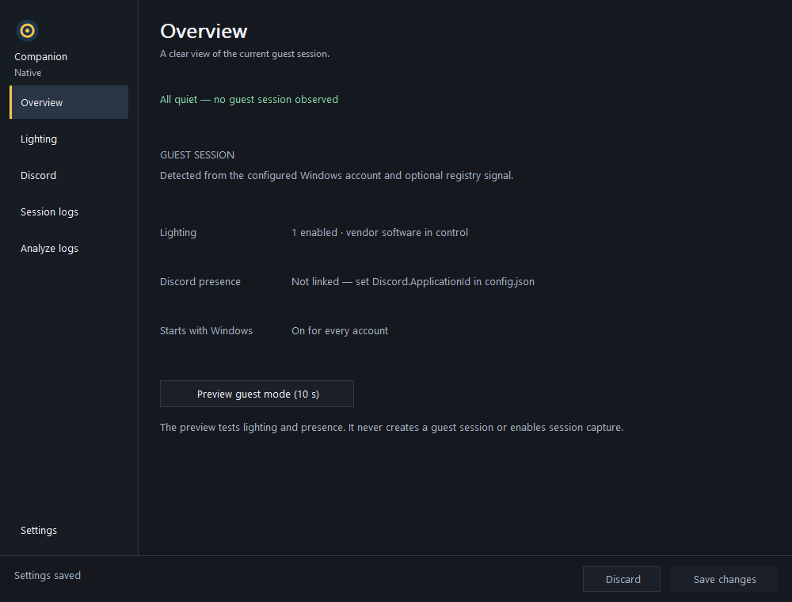
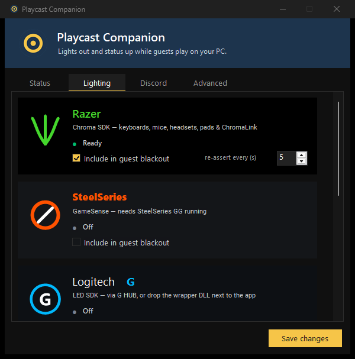
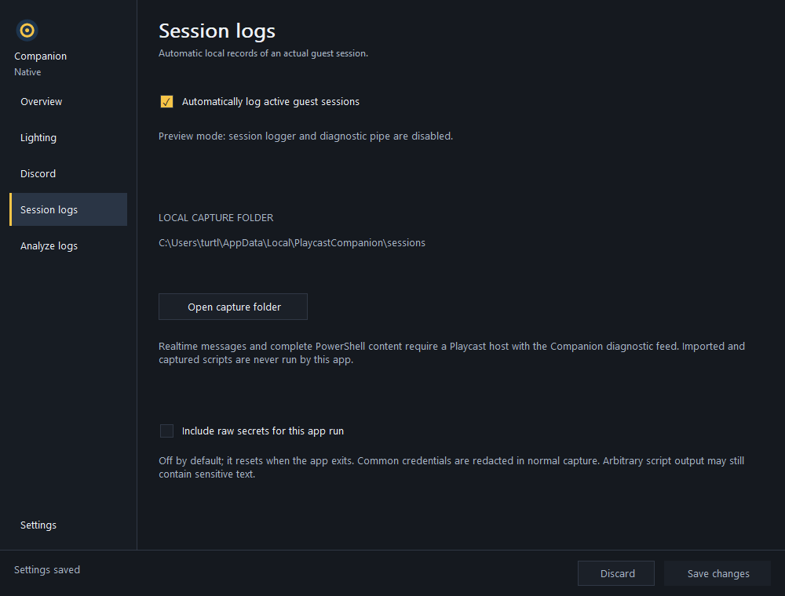
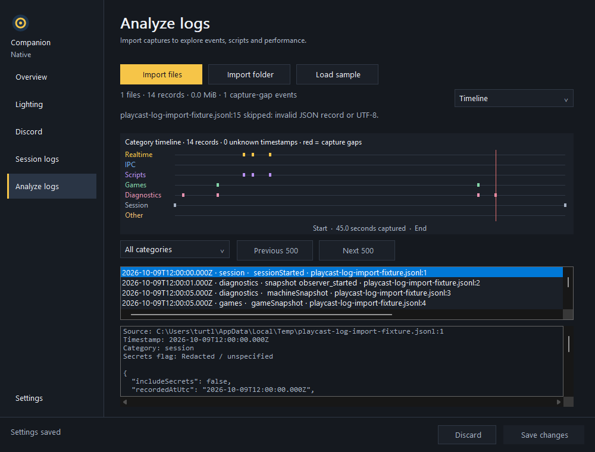

# Playcast Companion (native)

[](https://github.com/TypicalTitan/PlaycastCompanion-cpp/actions/workflows/build.yml)
[](LICENSE)


> **Unofficial.** A personal, open-source Windows utility for people who host
> cloud-gaming sessions with Playcast. It is not affiliated with, endorsed by, or
> supported by Playcast or any hardware vendor named below.

When a **guest account** signs in to your PC — the way a cloud-gaming host hands
the machine to a remote player — Playcast Companion makes it look neutral: **every
RGB lighting ecosystem you enable goes dark**, and (optionally) **your Discord
profile shows that you're hosting**. The instant the guest session ends, everything
hands back — your Synapse / iCUE / GG profiles return and the Discord status clears.
You never touch it after install; it watches Windows and reacts.

**Download:** [Native 3.2.3 installer and portable builds](https://github.com/TypicalTitan/PlaycastCompanion-cpp/releases/tag/v3.2.3).
The [regular C# 2.5.1 build](https://github.com/TypicalTitan/PlaycastCompanion/releases/tag/v2.5.1)
has the same sidebar and local log-analysis workflow. Both variants share an
install folder and configuration; choose the one you want to run.

<p align="center">
  
  &nbsp;
  
</p>

- Detects guest sessions from Windows session notifications and the optional
  registry signal. A local Playcast diagnostic feed supplies realtime and script
  details when the host contains the Companion hook.
- Lighting: **Razer Chroma**, **SteelSeries GameSense**, **Logitech G**,
  **Corsair iCUE**, **OpenRGB** (motherboards, RAM, GPUs…), and **Windows
  Dynamic Lighting**, each individually selectable and safe to run together.
- Discord Rich Presence, with an optional "Hosting *{game}* in Nonsole Mode" line
  (*Nonsole Mode* = your guest account, named `NonsoleMode` by default).
- Runs unelevated, starts with Windows for every account, headless in the guest
  session, dark-themed settings window in yours.
- Automatically captures real guest sessions into local JSONL logs, with game
  inventory, process/resource snapshots, backend status, and feed coverage.
- Imports captured files or folders into a local analyzer with timelines,
  communication, script results, game inventory, and memory/CPU plots.

## At a glance

| Aspect | Detail |
|---|---|
| **Binary** | one statically linked `PlaycastCompanion.exe`, no runtime to install |
| **Source** | focused C++20 modules for backends, session capture, import, and UI |
| **Dependencies** | none beyond the Windows SDK (Win32, WinHTTP, Winsock, GDI+, C++/WinRT) |
| **Lighting ecosystems** | 6, each an isolated backend behind one interface |
| **Elevation** | never — runs `asInvoker`; only install / uninstall / config-save prompt for UAC |
| **Hardening** | `/W4 /WX /permissive- /sdl`, Control Flow Guard, CET shadow stacks, high-entropy ASLR, DEP, static CRT |
| **Build** | MSVC + CMake/Ninja; `build.cmd` from a fresh clone; CI-verified on `windows-latest` |

## Screenshots

| Overview | Lighting |
|---|---|
|  |  |
| Guest, lighting, Discord, and startup state. **Preview guest mode (10 s)** tests the effects without starting session capture. | Six compact ecosystem rows, individual status, and expandable advanced options. |

| Session logs | Analyze logs |
|---|---|
|  |  |
| Capture status, local folder, automatic logging, and the debug secrets toggle. | Category timeline, record selection, capture gaps, and the original record with file/line provenance. |

The six sidebar pages are **Overview**, **Lighting**, **Discord**, **Session logs**,
**Analyze logs**, and **Settings**. Edits remain staged until **Save changes**;
**Discard** restores the saved settings. The resizable window uses Win32 + GDI+
with a slate palette and gold accents. These images come from its side-effect-free
`--snapshot` harness using a synthetic session capture.

Native 3.2.1 fixes mouse-wheel routing between the page, analyzer list, and text
inspector. Scrolling follows the pointer while keyboard focus stays in place;
closed dropdowns no longer change the analyzer view when scrolling the page.

Native 3.2.2 corrects guest launcher discovery, retains inaccessible Playcast
processes with partial coverage, and adds bounded final snapshots after session
cleanup. Dynamic Lighting cannot accumulate cancelled-but-pending operations;
Chroma release status reflects the actual HTTP result.

Native 3.2.3 derives executable version resources from the CMake project version
and isolates guest inventory fixtures, correcting the Windows file version and
a fast-runner CI failure. It includes all 3.2.2 fixes.

## Why native

- **No .NET runtime.** One statically linked Win32 exe. Nothing to install or
  keep patched besides Windows itself.
- **Instant start.** No JIT, no runtime extraction — the tray icon is up the
  moment you log on, in your session and in the guest's.
- **Drop-in upgrade.** It reads the same `config.json`, uses the same install
  folder, Run key, and Apps entry, and ships in the same NSIS setup, so it
  installs *over* the .NET version in place and keeps your settings.
- **Same hardening, closer to the metal.** Warnings-as-errors, `/sdl`, CFG, CET,
  ASLR/DEP; every byte from a pipe or socket validated and length-capped.

> There's a sibling C# / .NET project —
> [PlaycastCompanion](https://github.com/TypicalTitan/PlaycastCompanion) — with
> identical behaviour and the same `config.json`. This native build is a
> from-scratch port; pick whichever fits your stack.

## Requirements

| Need | Notes |
|---|---|
| Windows 11 (x64) | Windows 10 2004+ runs everything except Dynamic Lighting |
| To **run** a release build | Nothing else — the exe is self-contained (static CRT). |
| To **build** | Visual Studio 2022 Build Tools (or Visual Studio) with the **Desktop development with C++** workload; Windows 10 SDK 10.0.22621+ (included in the workload) |
| To build the **installer** (optional) | [NSIS 3.x](https://nsis.sourceforge.io/) |
| For each lighting ecosystem | That vendor's software running (Synapse, GG, G HUB, iCUE, OpenRGB) — see *Lighting engines* |
| For Discord | Discord desktop running, plus your own (free) Discord Application ID |

## Build — step by step

1. **Install the C++ toolchain** (one line, admin prompt). Either install the
   Build Tools and add the workload from the Visual Studio Installer:
   ```powershell
   winget install Microsoft.VisualStudio.2022.BuildTools
   ```
   then tick **Desktop development with C++** — or do both in one go:
   ```powershell
   winget install --id Microsoft.VisualStudio.2022.BuildTools --override "--quiet --add Microsoft.VisualStudio.Workload.VCTools --includeRecommended"
   ```
   The workload brings MSVC, the Windows 10 SDK (10.0.22621+), CMake and
   Ninja; `build.cmd` finds them itself, so nothing needs to be on `PATH`.
   A full Visual Studio 2022 (Community/Professional/Enterprise) with the same
   workload works too.

2. **Clone and build:**
   ```powershell
   git clone https://github.com/TypicalTitan/PlaycastCompanion-cpp.git
   cd PlaycastCompanion-cpp
   build.cmd
   ```
   Produces `build\PlaycastCompanion.exe` — a single static exe; no runtime
   needed on the target. `build.cmd debug` makes a Debug build, and
   `build.cmd check <File.cpp>` compiles one source file warning-free without
   linking (the `/W4 /WX` gate used during development).

3. **(Optional) Build the installer:**
   ```powershell
   winget install NSIS.NSIS
   installer\build-setup.cmd
   ```
   Produces `installer\PlaycastCompanionSetup-<version>.exe`. The script runs
   step 2 (Release), stages `build\PlaycastCompanion.exe` + `config.json` into
   `installer\payload`, compiles the NSIS script, and fails loudly if anything
   is missing.

CI builds, runs the CTest contract suites, and packages the installer on every
push ([`.github/workflows/build.yml`](.github/workflows/build.yml)). It uploads
the executable and installer as artifacts. Run contracts locally with
`ctest --test-dir build --output-on-failure` from a configured developer shell.

## Install

Run the setup (one UAC prompt; silent `/S` supported). It:
- installs to `%ProgramFiles%\PlaycastCompanion` (fixed path; standard users —
  including the guest account — can only read it);
- enables autostart for **every** account via `HKLM\…\Run` (passes
  `--autostart`, so logon starts are silent);
- adds a Start Menu shortcut and a Settings → Apps entry with a real uninstaller;
- preserves your `config.json` across upgrades — including an upgrade from the
  .NET build, which lives in the same folder.

Uninstall from Settings → Apps. It stops all instances, removes autostart
entries, the Apps entry, the install folder (guarded: only if it actually
contains `PlaycastCompanion.exe`), and the current user's log folder.

## First run

1. Launch it (Start Menu, or the exe). A dark settings window opens; the tray
   icon is the app mark — bright when idle, dimmed while a guest is hosting.
2. **Settings → Guest Windows account**: the Windows account your host signs
   guests into (default `NonsoleMode`). Case-insensitive.
3. **Lighting**: tick the ecosystems you own.
4. **Discord** (optional): see *Discord* below.
5. **Save changes** applies the edited configuration. Account/registry changes
   take effect on restart (the app offers one).
6. **Overview → Preview guest mode (10 s)** runs the full effect so you can
   see it without a real guest.

## Session logging and local analysis

Captures start automatically for real guest sessions, including passive game and
resource snapshots. Complete realtime messages and PowerShell bodies require the
Playcast diagnostic hook. Credentials are redacted by default; the in-app secrets
toggle affects this process only and resets on restart.

**Analyze logs** imports files or folders, accepts dropped files, and includes a
synthetic sample. Timeline, Communications, Scripts, Games, and Health views show
captured content with source file/line provenance and explicit unknown coverage.
Imports stay local and scripts are never executed. Read
[the logging and analysis guide](docs/SESSION_LOGGING.md) for usage, privacy,
capture limits, and the host-hook requirement.

## How it works

A hidden window registers `WTSRegisterSessionNotification(NOTIFY_FOR_ALL_SESSIONS)`.
On every logon/logoff/connect/disconnect (plus a 30 s safety poll and once at
startup) it enumerates sessions and asks *does the guest account have one?* When
yes, each enabled lighting backend starts a hold loop (connect → assert black →
heartbeat/re-assert every few seconds; retry quietly every 30 s if the vendor
software isn't there) and Discord presence goes live. When no, every backend
releases and the presence clears. Everything degrades gracefully — a missing
SDK or a closed Discord is a status line, never an error dialog.

Two instances coexist by design (one per Windows session, `Local\` mutex): the
one in the guest session runs **headless** — no tray icon, no window, nothing
for a guest to click — and holds the blackout independently of the one in your
session.

## Architecture

Everything non-trivial sits behind one small interface, so backends are
independent and easy to reason about (or lift into another product — see
[`INTEGRATION.md`](INTEGRATION.md)):

```cpp
class ILightingBackend {
    virtual std::wstring DisplayName() const = 0;
    virtual bool         Enabled()     const = 0;   // reads live config
    virtual bool         IsHolding()   const = 0;
    virtual std::wstring StatusText()  const = 0;
    virtual void         StartBlackout()     = 0;   // no-op if already running or !Enabled()
    virtual void         StopBlackout()      = 0;   // stops, joins, releases; returns within ~5 s
};
```

`LightingBackendBase` supplies the shared hold/release loop — a `std::jthread`
that re-asserts the blackout every tick and retries after a failure — so each of
the six backends is just a thin protocol adapter over its vendor's API. Adding a
seventh ecosystem is one class.

- **Threading** is `std::jthread` + `std::stop_token` throughout; a start/stop
  lifecycle mutex serialises the worker so `StopBlackout()` always joins and
  restores cleanly, and blocking I/O is cancellable so shutdown finishes in a
  few seconds. Any thread that calls WinRT initialises an MTA first.
- **No exceptions escape** a worker thread or a window procedure — they're
  caught, logged, and retried.
- **Everything from outside is untrusted:** config, HTTP bodies, pipe and socket
  frames are length-capped (≤ 1 MB), names are bounded, control characters are
  stripped, and the Chroma REST URL is forced to loopback.

**Source layout** (`src/`, no external dependencies):

```
Log · Json · Config · Http          core: logging, JSON (Windows.Data.Json), config, WinHTTP
LightingBackend · NativeResolver    the ILightingBackend base loop + lazy vendor-DLL loader
Chroma · SteelSeries · OpenRgb      REST / TCP backends (WinHTTP, Winsock)
Logitech · Corsair                  vendor-DLL backends (runtime-loaded, never bundled)
DynamicLighting                     Windows Dynamic Lighting via WinRT LampArray
SessionWatcher · RegistryWatcher    the guest-mode signals
DiscordPresence · GameNameCache     Rich Presence over the local IPC pipe + id→name resolver
DiscordShim                         optional guest→owner game pass-through (shim + ACL'd relay)
TrayApp · main                      orchestration, tray icon, single-instance, CLI flags
MainWindow* · Branding              sidebar pages, controls, charts and drawn marks
SessionLogging*                    pipe, privacy, storage, inventory and snapshots
LogAnalysis*                       bounded importer and record projections
```

## Lighting engines

| Engine | Talks via | Needs | Notes |
|---|---|---|---|
| Razer Chroma | REST `localhost:54235` (WinHTTP) | Razer Synapse | Session heartbeat < 15 s; re-asserts so Synapse can't fight back. Released = Synapse profile returns. |
| SteelSeries GameSense | REST (address from `coreProps.json`) | SteelSeries GG | Binds one colour handler per device type, independently. |
| Logitech G | LED Illumination SDK (DLL, loaded at runtime) | G HUB, or `LogitechLedEnginesWrapper.dll` beside the exe | True save/restore. DLL is **not** bundled. |
| Corsair iCUE | CUE SDK v3 (DLL, loaded at runtime) | `CUESDK.x64_2017.dll` beside the exe | Exclusive control while held. DLL is **not** bundled. |
| OpenRGB | TCP SDK server `:6742` (Winsock) | OpenRGB running as server | Saves your lighting to a restore profile, loads your all-black profile (create one named `Blackout`), swaps back on release. |
| Windows Dynamic Lighting | WinRT `LampArray` (C++/WinRT) | Win11 + LampArray devices | **Skips devices an enabled vendor engine already owns** (e.g. Razer gear, which Razer surfaces to WDL), so engines never fight. Disable with `DynamicLighting.ExcludeVendorOwnedDevices`. |

Every other engine only ever touches its own vendor's devices, so they all run
side by side.

## Discord

1. Create a free application at <https://discord.com/developers/applications>.
   Its **name** renders as "Playing …".
2. Put its **Application ID** into `config.json` → `Discord.ApplicationId`
   (deliberately config-file-only; not editable in the UI).
3. Optionally upload an image as a **Rich Presence → Art Asset** with the key
   in `Discord.LargeImageKey`.

The two status lines are editable on the Discord page, with a live preview.

### Game pass-through (optional, default OFF)
Can turn the line into **"Hosting Fortnite in Nonsole Mode"**. A shim in the
guest session offers a Discord-compatible IPC endpoint on `discord-ipc-1..9`
(never `-0`, so it cannot interfere with your real Discord); a game the guest
launches may connect, the shim reads only its **Application ID** from the
handshake (rich-presence frames are discarded) and relays it over an ACL'd,
caller-verified pipe to your session, which resolves the name via Discord's
public app registry (cached) and fills `HostingTemplate`.

**Known limitation, by design:** the pipe namespace is machine-global and your
real Discord owns `discord-ipc-0`, whose permissions deny the guest account. A
game that is denied there and *gives up* (Discord's canonical native library
does) never reaches the shim — it isn't captured and the static line is shown.
Games whose client advances past a denied slot are captured. Validate against
your own games: the log shows `Shim: game connected … client_id …` or a
`no game has connected yet` heartbeat.

## Configuration

`config.json` next to the exe (comments allowed). All values are validated and
clamped on load. Most are editable from the window. The file is byte-for-byte
compatible with the C# build's — key names and semantics are identical.

| Key | Default | Meaning |
|---|---|---|
| `TargetUsername` | `NonsoleMode` | Guest account whose session triggers stealth mode. |
| `TickSeconds` | `5` | Chroma heartbeat/re-apply cadence (1–10). |
| `RetryInitSeconds` | `30` | Retry interval when a vendor API is unreachable. |
| `IncludeDisconnectedSessions` | `true` | A disconnected-but-signed-in guest still counts. |
| `ChromaInitUrl` | `http://localhost:54235/razer/chromasdk` | Must be a loopback URL. |
| `RazerEnabled`, `SteelSeries.Enabled`, `Logitech.Enabled`, `Corsair.Enabled`, `OpenRgb.Enabled`, `DynamicLighting.Enabled` | Razer `true`, others `false` | Which engines join the blackout. |
| `OpenRgb.Host` / `.Port` / `.BlackoutProfile` | `127.0.0.1` / `6742` / `Blackout` | OpenRGB server and the all-black profile to load. |
| `DynamicLighting.ExcludeVendorOwnedDevices` | `true` | Don't double-drive devices a vendor engine owns. |
| `Discord.Enabled` / `.ApplicationId` / `.Details` / `.State` / `.LargeImageKey` / `.LargeImageText` | — | Rich Presence settings. |
| `Discord.GamePassthroughEnabled` / `.HostingTemplate` / `.ShimFallbackGame` / `.ShimPipeName` | `false` / `Hosting {game} in Nonsole Mode` / … | Game pass-through. |
| `RegistryWatch.*` | disabled | Optional extra guest-mode signal (a registry value Playcast writes while a guest display is up), ORed with session detection. |
| `SessionLogging.Enabled` / `.SnapshotIntervalSeconds` | `true` / `30` | Automatically capture real target sessions and periodic passive snapshots. |
| `SessionLogging.MaxFileBytes` / `.MaxSessionBytes` / `.RetentionDays` | 10 MiB / 100 MiB / `14` | File rotation, total session budget, and completed-session retention. |

## Security model

- Binary and config under Program Files (admin-write-only); autostart in HKLM —
  the guest account can't replace the exe, edit settings, or disable autostart.
- The app never runs elevated; install/uninstall/config-save each take one UAC.
- Fail-safe restore: Chroma drops a session that stops heartbeating for ~15 s,
  Discord clears an activity when its pipe closes — lights and profile come
  back even after a hard kill.
- Unhandled exceptions are logged (`%LOCALAPPDATA%\PlaycastCompanion\playcast-companion.log`),
  never shown as dialogs a guest could see.
- The relay pipe is ACL'd to the guest account and re-verifies the caller, so
  no other local process can inject a game name into your Discord.
- All config strings are sanitized and length-capped; the Chroma URL must be
  loopback. Pipe/socket frames are capped at 1 MB and names are length-capped
  before use.
- Hardened binary: `/W4 /WX /sdl /GS`, Control Flow Guard, CET shadow stacks,
  ASLR (high-entropy), DEP; static CRT so no DLL beside the exe can be swapped.

## Project layout

```
PlaycastCompanion-cpp/
├─ src/                     focused application modules (see Architecture)
├─ tests/                   session logger and importer contracts
├─ installer/               NSIS setup: installer.nsi + build-setup.cmd
├─ docs/screenshots/        the images above
├─ .github/workflows/       CI: build.yml (MSVC + Ninja on windows-latest)
├─ CMakeLists.txt           hardened build config (flags, libs, manifest, rc)
├─ build.cmd                one-command build / check / debug wrapper
├─ config.json              default configuration (shipped in the installer)
├─ README.md · LICENSE · THIRD_PARTY_NOTICES.md · INTEGRATION.md · PORTING.md
```

## Dev harness flags

- `--snapshot <dir>` renders every sidebar page to PNG (review UI without a
  desktop; these README shots come from it). Side-effect free — it never starts
  a blackout or touches Discord.
- `--snapshot-log <file>` adds all analyzer views to `--snapshot` using a local
  capture file; the screenshot harness does not start the session logger.
- `--test-ui-scroll` runs the mouse-wheel contracts on real offscreen controls,
  with session capture, lighting, and Discord disabled.
- `--lamps [file]` lists every LampArray device the OS exposes and whether the
  app can drive it.
- `--autostart` quiet start (used by the Run key); a second manual launch just
  raises the running instance's window.

## Legal & trademarks

This repository contains **no** vendor logos, fonts, or Playcast artwork — the
cards use original drawn marks and plain brand names/colours. Product names are
used only to identify interoperability; see
[`THIRD_PARTY_NOTICES.md`](THIRD_PARTY_NOTICES.md). The app links only Windows
SDK components; no third-party libraries.

Integrating this into a product? See [`INTEGRATION.md`](INTEGRATION.md).

## License

MIT — see [`LICENSE`](LICENSE).
